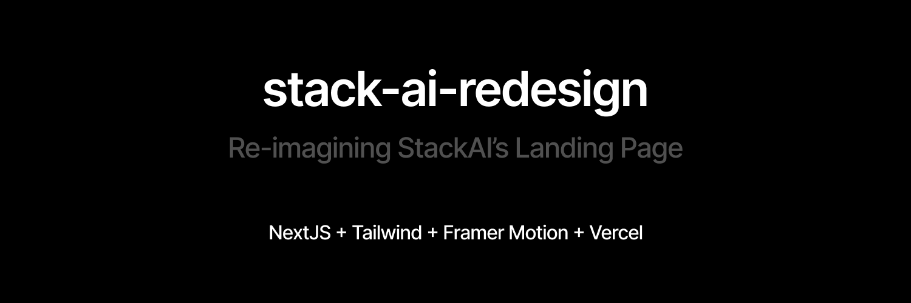

# stack-ai-redesign



## Deployed using vercel ▲

Landing page is live at [stack-ai-redesign.vercel.app](https://stack-ai-redesign.vercel.app/)

## Description

This is a redesign of [Stack AI](https://stack-ai.com)'s landing page with new components and new approaches.

Design Engineer Role Assignment by [Yash Sehgal](https://yashsehgal.com)

## Getting Started

### Clone the reposistory

```
git clone https://github.com/yashsehgal/stack-ai-redesign.git
```

### Navigate to the Project Directory

```
cd stack-ai-redesign
```

### Install Dependencies

```
yarn
```

### Run the Development Server

```
yarn dev
```

### Code formatting using prettier

After writing some code, make sure the apply prettier code formatting before pushing changes.

```
yarn run lint-fix
```

### Access the application

Open your web browser and visit http://localhost:3000 to see your Next.js app running locally.

Now you have your Next.js project set up on your local machine, and you can start making changes or additions to the code.

### Project Structure

```stack-ai-redesign/
├── components/
│   ├── ui/
│   │   ├── usables/
│   │   │   └── (usable component files)
│   │   ├── bento-card.tsx
│   │   ├── button.tsx
│   │   ├── cta.tsx
│   │   ├── feature-card.tsx
│   │   ├── feature-icon.tsx
│   │   ├── logo.tsx
│   │   ├── navigation-menu.tsx
│   │   └── index.tsx
│   ├── sections/
│   │   ├── basic-features.tsx
│   │   ├── data-loaders.tsx
│   │   ├── features-bento.tsx
│   │   ├── hero.tsx
│   │   ├── how-to-use.tsx
│   │   ├── models-used.tsx
│   │   ├── navbar.tsx
│   │   ├── security.tsx
│   │   └── index.tsx
│   └── layouts/
│       ├── section-container.tsx
│       ├── view-container.tsx
│       └── index.tsx
├── helpers/
│   ├── utils.ts
│   └── index.ts
├── app/
│   ├── favicon.ico
│   ├── globals.css
│   ├── layout.tsx
│   └── page.tsx
├── pages/
│   └── index.js
├── public/
│   └── ...
├── styles/
│   └── ...
├── .gitignore
├── package.json
└── README.md
```
